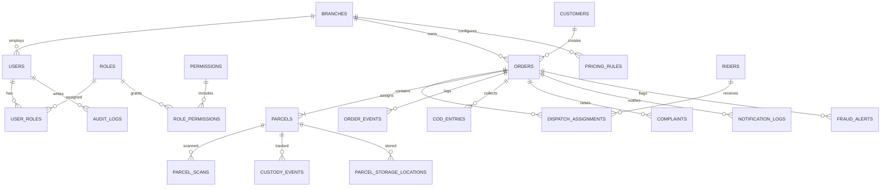

# ER Diagram

```mermaid
erDiagram
  USERS ||--o{ USER_ROLES : has
  ROLES ||--o{ USER_ROLES : assigned
  ROLES ||--o{ ROLE_PERMISSIONS : grants
  PERMISSIONS ||--o{ ROLE_PERMISSIONS : includes

  BRANCHES ||--o{ USERS : employs
  BRANCHES ||--o{ ORDERS : owns
  BRANCHES ||--o{ PRICING_RULES : configures

  CUSTOMERS ||--o{ ORDERS : creates
  RIDERS ||--o{ DISPATCH_ASSIGNMENTS : receives
  ORDERS ||--o{ DISPATCH_ASSIGNMENTS : assigns

  ORDERS ||--|{ PARCELS : contains
  PARCELS ||--o{ PARCEL_SCANS : scanned
  PARCELS ||--o{ CUSTODY_EVENTS : tracked
  PARCELS ||--o{ PARCEL_STORAGE_LOCATIONS : stored

  ORDERS ||--o{ ORDER_EVENTS : logs
  ORDERS ||--o{ COD_ENTRIES : collects
  ORDERS ||--o{ COMPLAINTS : raises

  USERS ||--o{ AUDIT_LOGS : writes
  ORDERS ||--o{ NOTIFICATION_LOGS : notifies
  ORDERS ||--o{ FRAUD_ALERTS : flags
```
